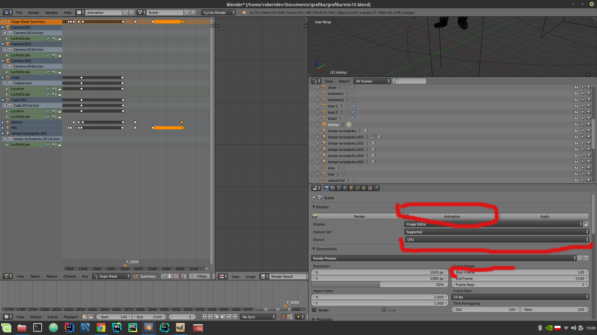

# GraphicsProject
Short video created using blender

(In progress)

<h1>How to render?</h1>

<ol>
  <li>Clone this repo</li>
  <li>Open the mis15.blend file</li>
  <li>Go into file->user preferences->system 
    and find compute device choose your graphics card</li>
  <li>Save user settings</li>
  
  <li>Choose the output directory</li>
  
  <li>Select your gpu in device and make sure the starting frame is set to 1100</li>
  <li>Click animation</li>
  
  <li>Wait</li>
  
</ol>
